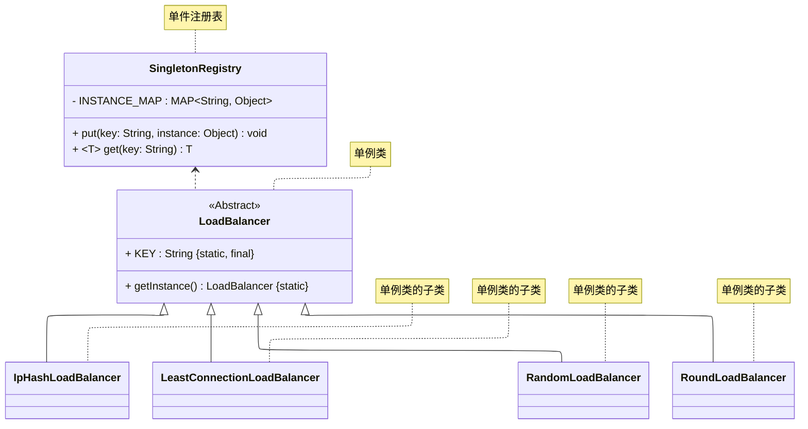

# README
创建单例类的子类有以下三种方式：
+ getInstance 中硬编码所有可能的单例类
+ 在编译时链接指定单例类
+ 使用单件注册表
> 案例改编自 《Java 设计模式》 —— 刘伟 著 —— 8.3 节。
## 方式一
getInstance 中硬编码所有可能的单例类，详细请参考源代码[src/org/example/case01/Main.java](./src/org/example/case01/Main.java)
## 方式二
Java 中不能像 C++ 一样在编译时将子类的类型绑定到唯一实例上，这里使用 ServiceLoader 机制来模仿该行为。 
详细请参考源代码[src/org/example/case02/Main.java](./src/org/example/case02/Main.java)
## 方式三
使用单件注册表。该设计方案为：父类 LoadBalancer 仅提供一个 getInstance 作为唯一实例的全局访问点，
子类在静态代码块中向注册表注册自身，外部客户端加载指定子类即可在运行期间指定唯一实例的类型。
详细请参考源代码[src/org/example/case03/Main.java](./src/org/example/case03/Main.java)

其 UML 类图如下所示：

## 参考资料
1. 《设计模式：可复用面向对象软件的基础》—— Erich Gamma 著 —— 李英军 译 —— 3.5.8.2 节（P 99）