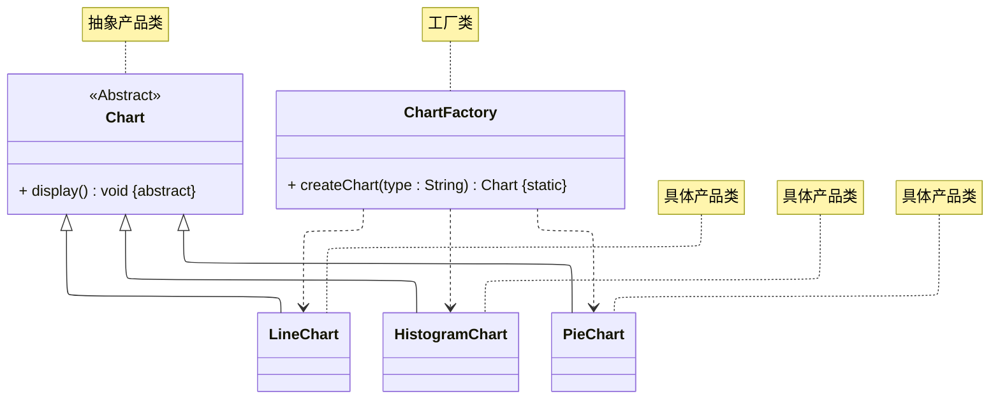
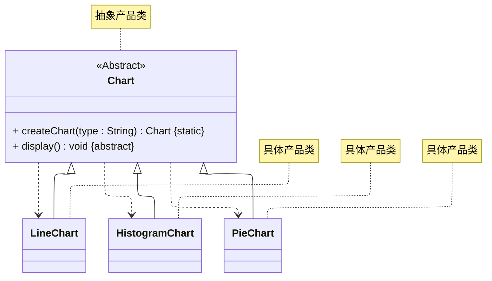

# README
演示以下两种简单工厂模式的编写：
+ 完整版
+ 省略 Factory（合并抽象产品类和工厂类）

> 案例改编自 《Java 设计模式》 —— 刘伟 著 —— 第 3.4 节
## 完整版实现
完整版：详细请参考源代码：[src/org/example/org.example.case01/Main.java](./src/org/example/case01/Main.java)

其 UML 类图如下所示：

## 省略 Factory 实现
省略Factory（合并抽象产品类和工厂类）：详细请参考源代码：[src/org/example/case02/Main.java](./src/org/example/case02/Main.java)

其 UML 类图如下所示：

## 简单工厂模式的应用
Java 语言中 Calendar 类、 DateFormat 类的设计就采用了简化后的简单工厂模式。
## 参考资料
学习视频：
1. [Java设计模式详解 —— 黑马程序员 —— 简单工厂模式（P34 ~ P37）](https://www.bilibili.com/video/BV1Np4y1z7BU?p=34)
2. [Java设计模式 —— 尚硅谷 —— 简单工厂模式（P39 ~ P42）](https://www.bilibili.com/video/BV1G4411c7N4?p=39)

学习读物：
1. 《Java 设计模式》 —— 刘伟 著 —— 第 3 章（P27）