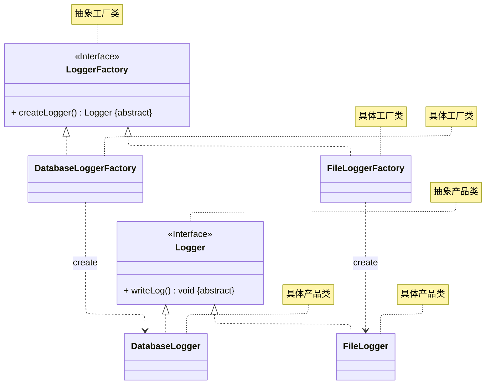
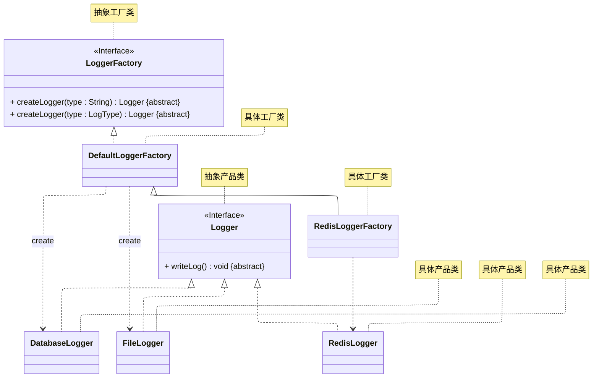
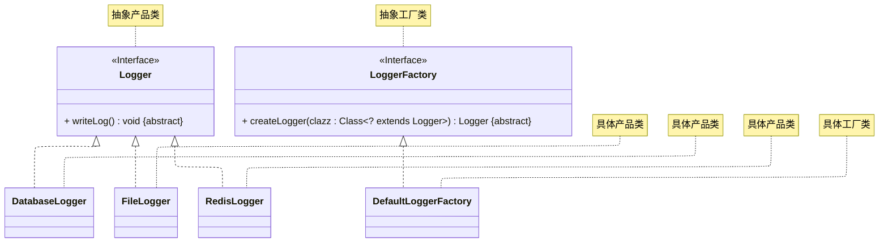

# README
演示以下 3 种工厂方法模式的实现：
+ 工厂方法不包含类型控制参数
+ 工厂方法包含类型控制参数
  + 简单字符串、枚举
  + 类限定名
> 案例改编自 《Java 设计模式》 —— 刘伟 著 —— 第 4.3 节
## 实现一
工厂方法不包含类型控制参数：详细请参考源代码：[src/org/example/case01/Main.java](./src/org/example/case01/Main.java)
+ 优点：实现简单。
+ 缺点：每一个产品类都要对应一个产品工厂，容易出现子类爆炸的问题。

其 UML 类图如下所示：

## 实现二
简单字符串、枚举：详细请参考源代码：[src/org/example/case02/Main.java](./src/org/example/case02/Main.java)
+ 优点：实现简单，可以有效减少子类的数量。
+ 缺点：在默认实现类中限定了所有可能的产品，如果要添加新的产品，需要通过继承默认实现类或抽象工厂类编写独立创建逻辑。

其 UML 类图如下所示：

## 实现三
类限定名：详细请参考源代码：[src/org/example/case03/Main.java](./src/org/example/case03/Main.java)
+ 优点：可以有效减少子类的数量，不用在默认实现类中限定所有可能的产品。
+ 缺点：实现复杂，且只能用于创建逻辑简单的场景；一旦添加了需要复杂创建逻辑的产品，仍需要通过继承默认实现类或抽象工厂类编写独立创建逻辑。

其 UML 类图如下所示：

## 参考资料
学习视频：
1. [设计模式快速入门 —— 图灵星球TuringPlanet —— 工厂方法模式](https://www.bilibili.com/video/BV1284y1H7FR/)
2. [Java设计模式详解 —— 黑马程序员 —— 工厂方法模式（P38 ~ P40）](https://www.bilibili.com/video/BV1Np4y1z7BU?p=38)
3. [Java设计模式 —— 尚硅谷 —— 单例模式（P43 ~ P44）](https://www.bilibili.com/video/BV1G4411c7N4?p=43)

学习读物：
1. 《设计模式：可复用面向对象软件的基础》—— Erich Gamma 著 —— 李英军 译 —— 第 3.3 节（P81）
2. 《Java 设计模式》 —— 刘伟 著 —— 第 4 章（P42）
3. 《设计模式之美》—— 王争 著 —— 第 6.3 节（P180）
4. 《设计模式之禅》 —— 第 2 版 —— 秦小波 著 —— 第 8 章（P65）
5. 《图解设计模式》—— 结城浩 著 —— 杨文轩 译 —— 第 4 章（P33）

电子文献：
1. [设计模式教程 —— 菜鸟教程 —— 工厂方法模式](https://www.runoob.com/design-pattern/factory-pattern.html)
2. [99+ 种软件模式 —— long2ge —— 工厂方法模式](https://learnku.com/docs/99-software-pattern/factory-pattern/11960)