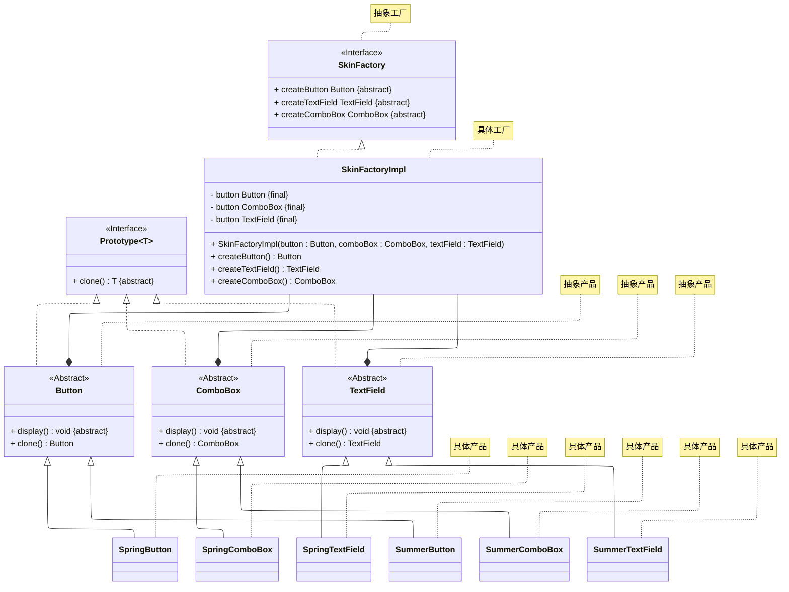

# README
## 与原型模式结合的抽象工厂模式的实现
演示与原型模式结合的抽象工厂模式的实现，详细请参考源代码：[src/org/example/Main.java](./src/org/example/Main.java)

> 案例改编自 《Java 设计模式》 —— 刘伟 著 —— 第 5.4 节

其 UML 类图如下所示：

## 参考资料
学习读物： 《设计模式：可复用面向对象软件的基础》—— Erich Gamma 著 —— 李英军 译 —— 第 3.1 节（P66）