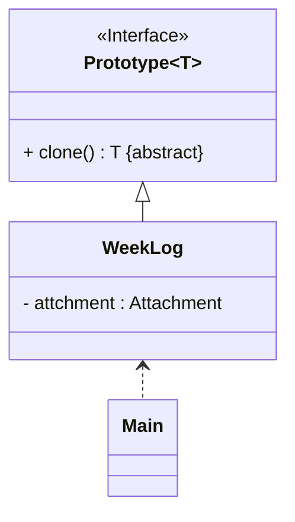

# README
## 原型模式的实现
演示以下 2 种原型模式的实现：
+ 浅克隆实现：详细请参考源代码：[src/org/example/org.example.case01/Main.java](src/org/example/case01/Main.java)
+ 深克隆实现：详细请参考源代码：[src/org/example/case02/Main.java](src/org/example/case02/Main.java)

> 案例改编自 《Java 设计模式》 —— 刘伟 著 —— 第 7.3 节

上述两种实现方式中类之间的关系是相同的，其 UML 类图为：

## 参考资料
学习视频：
1. [设计模式快速入门 —— 图灵星球TuringPlanet —— 原型模式](https://www.bilibili.com/video/BV1XM411c72S/)
2. [Java设计模式详解 —— 黑马程序员 —— 抽象工厂模式（P46 ~ P49）](https://www.bilibili.com/video/BV1Np4y1z7BU?p=46)
3. [Java设计模式 —— 尚硅谷 —— 抽象工厂模式（P49 ~ P54）](https://www.bilibili.com/video/BV1G4411c7N4?p=49)

学习读物：
1. 《设计模式：可复用面向对象软件的基础》—— Erich Gamma 著 —— 李英军 译 —— 第 3.4 节（P89）
2. 《Java 设计模式》 —— 刘伟 著 —— 第 7 章（P90）
3. 《设计模式之美》—— 王争 著 —— 第 6.6 节（P200）
4. 《设计模式之禅》 —— 第 2 版 —— 秦小波 著 —— 第 13 章（P135）
5. 《图解设计模式》—— 结城浩 著 —— 杨文轩 译 —— 第 6 章（P49）

电子文献：
1. [设计模式教程 —— 菜鸟教程 —— 原型模式](https://www.runoob.com/design-pattern/prototype-pattern.html)
2. [99+ 种软件模式 —— long2ge —— 原型模式](https://learnku.com/docs/99-software-pattern/prototype-pattern/11962)
3. [面向对象设计模式--原型模式详解+实际应用（Java）—— 飞天葫芦侠](https://cloud.tencent.com/developer/article/2244408)