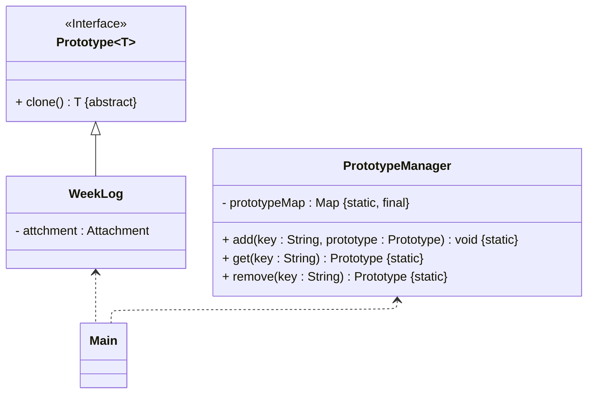

# README
## 使用原型管理器的原型模式的实现
演示使用原型管理器的原型模式的实现，详细请参考源代码[src/org/exampleMain.java](src/org/example/Main.java)

> 案例改编自 《Java 设计模式》 —— 刘伟 著 —— 第 7.3 节

其 UML 类图如下所示：

## 参考资料
学习读物：《设计模式：可复用面向对象软件的基础》—— Erich Gamma 著 —— 李英军 译 —— 第 3.4 节（P89）
电子文献：[面向对象设计模式--原型模式详解+实际应用（Java）—— 飞天葫芦侠](https://cloud.tencent.com/developer/article/2244408)