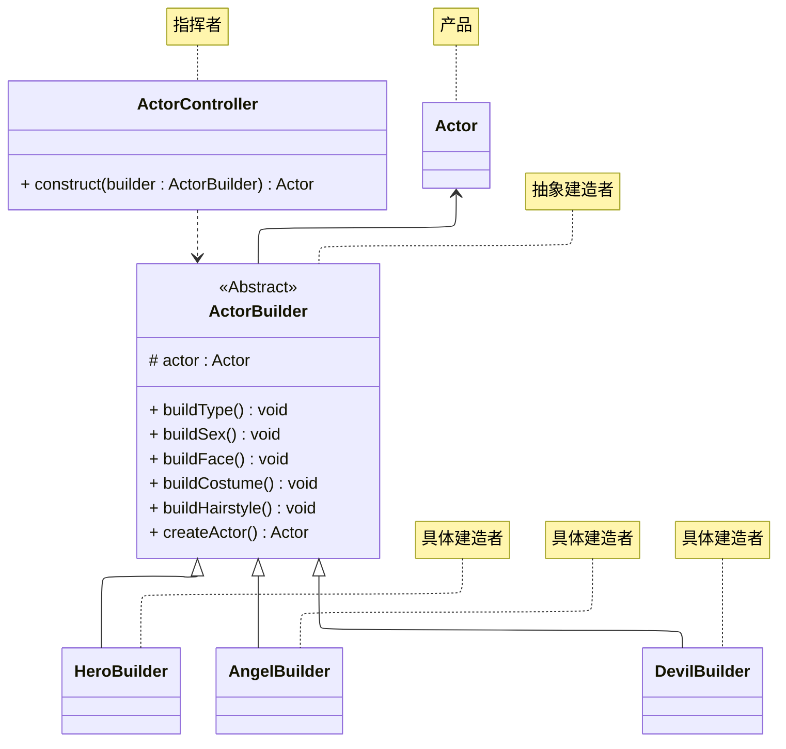
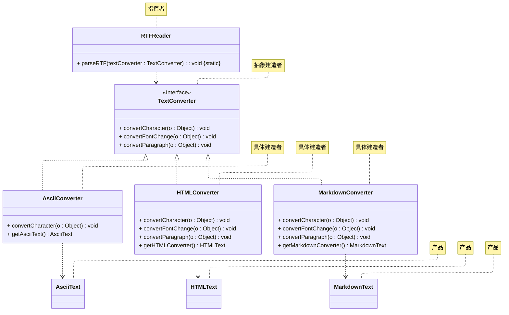

# README
演示以下两种建造者模式的实现方式。
## 建造者模式的实现方式一
在该实现方式中，Builder 类声明了两类方法，Director 将 Builder 声明为 construct 方法的形参，并将 Product 对象作为 construct 方法的返回值。

详细请参考源代码：[src/org/example/case01/Main.java](./src/org/example/case01/Main.java)

其 UML 类图如下所示：

> 案例改编自 《Java 设计模式》 —— 刘伟 著 —— 第 6.3 节
## 建造者模式的实现方式二
在该实现方式中，Builder 类仅声明 buildPartX() 方法，Director 将 Builder 声明为 construct 方法的形参，并将 construct 方法没有返回值。

详细请参考源代码：[src/org/example/case02/Main.java](./src/org/example/case02/Main.java)

> 案例改编自 《设计模式：可复用面向对象软件的基础》—— Erich Gamma 著 —— 李英军 译 —— 第 3.2.2 节

其 UML 类图如下所示：

## 参考资料
学习视频：
1. [设计模式快速入门 —— 图灵星球TuringPlanet —— 建造者模式](https://www.bilibili.com/video/BV1Hy4y197fR)
2. [Java设计模式详解 —— 黑马程序员 —— 建造者模式（P50 ~ P53）](https://www.bilibili.com/video/BV1Np4y1z7BU?p=50)
3. [Java设计模式 —— 尚硅谷 —— 建造者模式（P55 ~ P59）](https://www.bilibili.com/video/BV1G4411c7N4?p=55)

学习读物：
1. 《设计模式：可复用面向对象软件的基础》—— Erich Gamma 著 —— 李英军 译 —— 第 3.2 节（P74）
2. 《Java 设计模式》 —— 刘伟 著 —— 第 6 章（P72）
3. 《设计模式之美》—— 王争 著 —— 第 6.5 节（P194）
4. 《设计模式之禅》 —— 第 2 版 —— 秦小波 著 —— 第 11 章（P100）
5. 《图解设计模式》—— 结城浩 著 —— 杨文轩 译 —— 第 7 章（P61）

电子文献：
1. [设计模式教程 —— 菜鸟教程 —— 建造者模式](https://www.runoob.com/design-pattern/builder-pattern.html)
2. [99+ 种软件模式 —— long2ge —— 建造者模式](https://learnku.com/docs/99-software-pattern/builder-pattern/11961)
