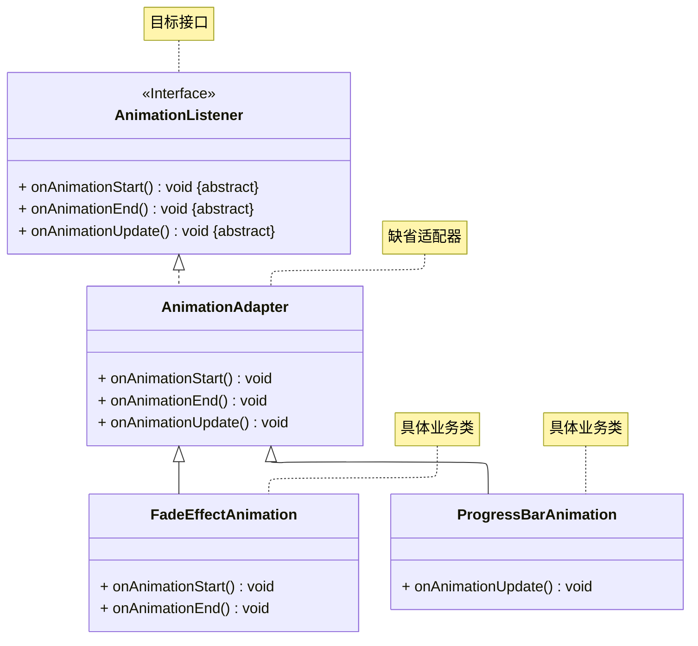

# README
## 缺省适配器模式的实现
演示缺省适配器模式的实现。

案例介绍：
某公司正在开发一款软件，软件在使用过程会经常播放动画。该软件的开发人员定义了 AnimationListener 用于定义软件在播放动画的过程中会遇到的各种
多种动画状态事件，例如 onAnimationStart()（动画开始）、onAnimationEnd()（动画结束）、 onFrameUpdate(float progress)
（每一帧更新时，传入播放进度）等。现在需要为不同的动画效果添加监听：
+ 一个淡入淡出的 FadeEffect 只关心 onAnimationStart()（初始化透明度）和 onAnimationEnd()（确保最终透明度）
+ 一个进度条动画 ProgressBar 必须监听 onFrameUpdate()（根据进度更新条的长度）

为了便于开发人员使用，请使用缺省适配器模式进行代码设计。

详细请参考源代码：详细请参考源代码：[src/org/example/Main.java](./src/org/example/Main.java)

其 UML 类图如下所示：

## 参考资料
学习视频：[Java设计模式 —— 尚硅谷 —— 适配器模式（P60 ~ P65）](https://www.bilibili.com/video/BV1G4411c7N4?p=60)

学习读物： 《Java 设计模式》 —— 刘伟 著 —— 第 9 章（P118）