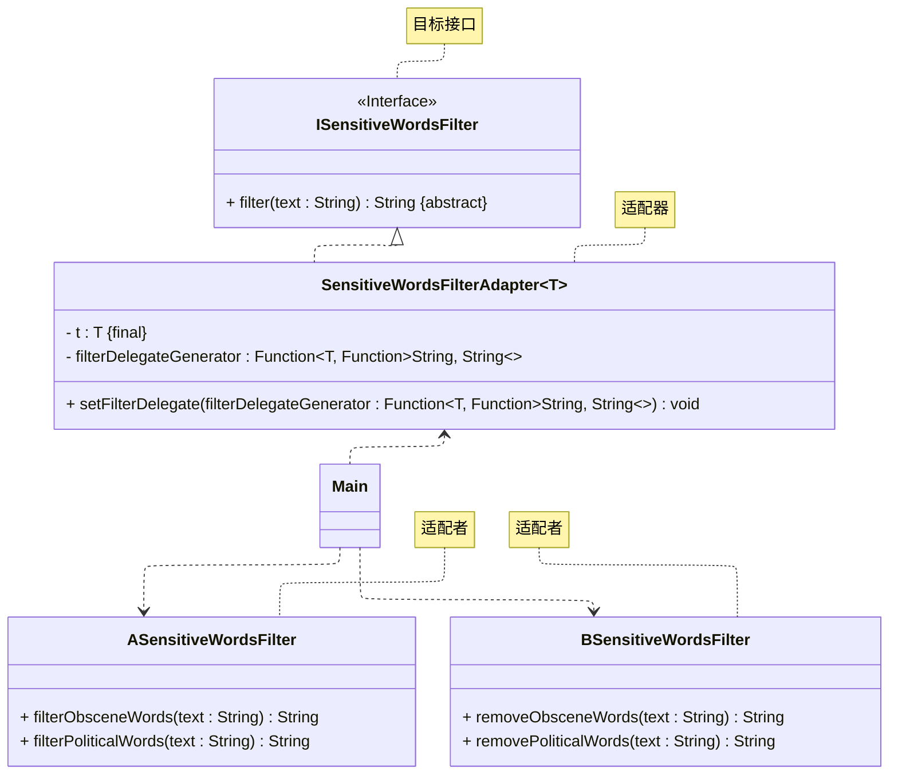

# README
## 参数化适配器的实现
演示参数化适配器的实现。
> 案例改编自 《设计模式之美》—— 王争 著 —— 第 7.3.2.2 节

详细请参考源代码：详细请参考源代码：[src/org/example/Main.java](./src/org/example/Main.java)

其 UML 类图如下所示：

## 参考资料
学习读物： 《设计模式：可复用面向对象软件的基础》—— Erich Gamma 著 —— 李英军 译 —— 第 4.1 节（P106）