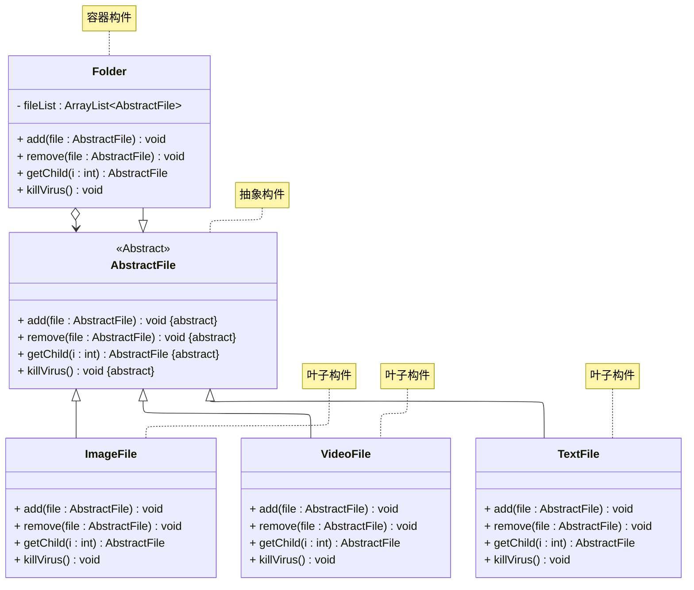
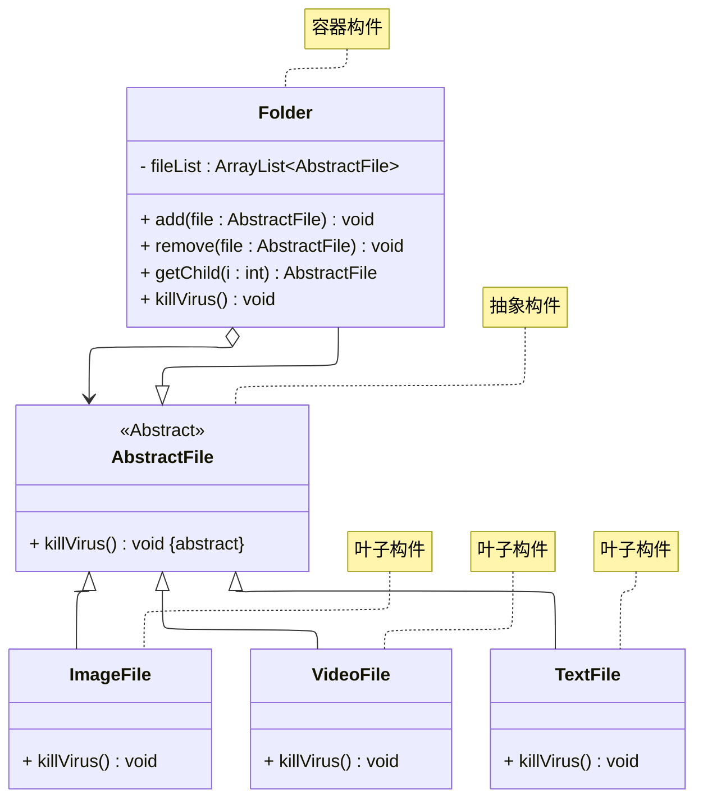

# README
演示两种组合模式的实现：
+ 透明组合模式
+ 安全组合模式

> 案例改编自 《Java 设计模式》 —— 刘伟 著 —— 第 11.3 节
## 透明组合模式的实现
详细请参考源代码：[src/org/example/org.example.case01/Main.java](./src/org/example/case01/Main.java)

其 UML 类图如下所示：

## 安全组合模式的实现
详细请参考源代码：[src/org/example/case02/Main.java](./src/org/example/case02/Main.java)

其 UML 类图如下所示：

## 参考资料
学习视频：
1. [设计模式快速入门 —— 图灵星球TuringPlanet —— 组合模式](https://www.bilibili.com/video/BV1bX4y1d7Ao)
2. [Java设计模式详解 —— 黑马程序员 —— 组合模式（P82 ~ P86）](https://www.bilibili.com/video/BV1Np4y1z7BU?p=82)
3. [Java设计模式 —— 尚硅谷 —— 组合模式（P77 ~ P80）](https://www.bilibili.com/video/BV1G4411c7N4?p=77)

学习读物：
1. 《设计模式：可复用面向对象软件的基础》—— Erich Gamma 著 —— 李英军 译 —— 第 4.3 节（P123）
2. 《Java 设计模式》 —— 刘伟 著 —— 第 11 章（P147）
3. 《设计模式之美》—— 王争 著 —— 第 7.6 节（P233）
4. 《设计模式之禅》 —— 第 2 版 —— 秦小波 著 —— 第 21 章（P240）
5. 《图解设计模式》—— 结城浩 著 —— 杨文轩 译 —— 第 11 章（P117）

电子文献：
1. [设计模式教程 —— 菜鸟教程 —— 组合模式](https://www.runoob.com/design-pattern/composite-pattern.html)
2. [99+ 种软件模式 —— long2ge —— 组合模式](https://learnku.com/docs/99-software-pattern/composite-pattern/11969)