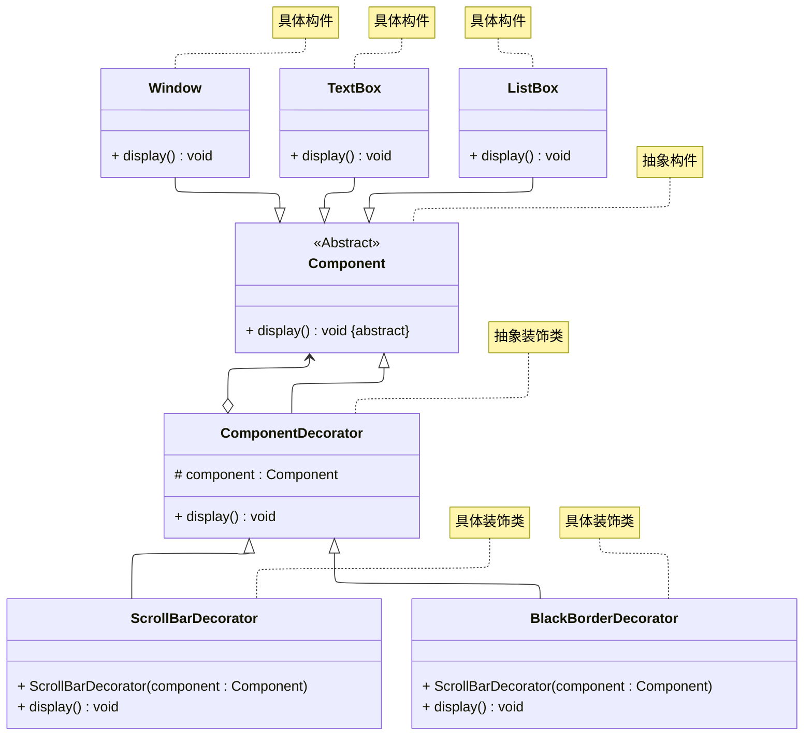
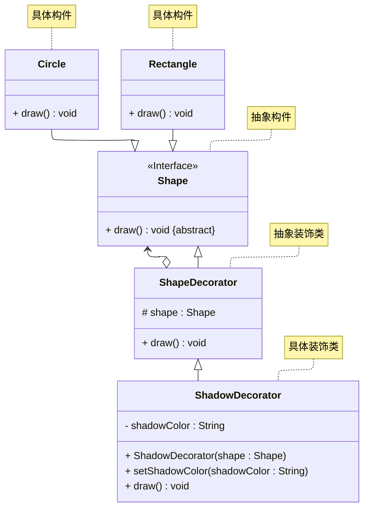

# README
演示两种装饰模式的实现：
+ 透明装饰模式
+ 半透明装饰模式
## 透明装饰模式的实现
详细请参考源代码：[src/org/example/org.example.case01/Main.java](./src/org/example/case01/Main.java)
> 案例改编自 《Java 设计模式》 —— 刘伟 著 —— 第 12.3 节

其 UML 类图如下所示：

## 半透明装饰模式的实现
案例介绍：某公司正在开发一个图形绘制系统，现有基础形状（如圆形）实现了 Shape 接口并具备绘制功能。现需为任意形状动态添加阴影效果（如
设置阴影颜色），且不能修改原始形状类代码。请使用半透明装饰模式设计并实现一个 ShadowDecorator 装饰器，在不改变 Shape 基本接口的同时，
允许外部代码访问新增的阴影设置功能（如 setShadowColor），从而在绘制时自动渲染阴影，实现功能增强与接口透明性的平衡。

详细请参考源代码：[src/org/example/case02/Main.java](./src/org/example/case02/Main.java)

其 UML 类图如下所示：

## 参考资料
学习视频：
1. [设计模式快速入门 —— 图灵星球TuringPlanet —— 装饰模式](https://www.bilibili.com/video/BV1zV4y1Q7ca/)
2. [Java设计模式详解 —— 黑马程序员 —— 装饰模式（P70 ~ P74）](https://www.bilibili.com/video/BV1Np4y1z7BU?p=70)
3. [Java设计模式 —— 尚硅谷 —— 装饰模式（P71 ~ P76）](https://www.bilibili.com/video/BV1G4411c7N4?p=71)

学习读物：
1. 《设计模式：可复用面向对象软件的基础》—— Erich Gamma 著 —— 李英军 译 —— 第 4.4 节（P132）
2. 《Java 设计模式》 —— 刘伟 著 —— 第 12 章（P161）
3. 《设计模式之美》—— 王争 著 —— 第 7.2 节（P213）
4. 《设计模式之禅》 —— 第 2 版 —— 秦小波 著 —— 第 17 章（P192）
5. 《图解设计模式》—— 结城浩 著 —— 杨文轩 译 —— 第 12 章（P129）

电子文献：
1. [设计模式教程 —— 菜鸟教程 —— 装饰模式](https://www.runoob.com/design-pattern/decorator-pattern.html)
2. [99+ 种软件模式 —— long2ge —— 装饰模式](https://learnku.com/docs/99-software-pattern/decorator-pattern/11968)