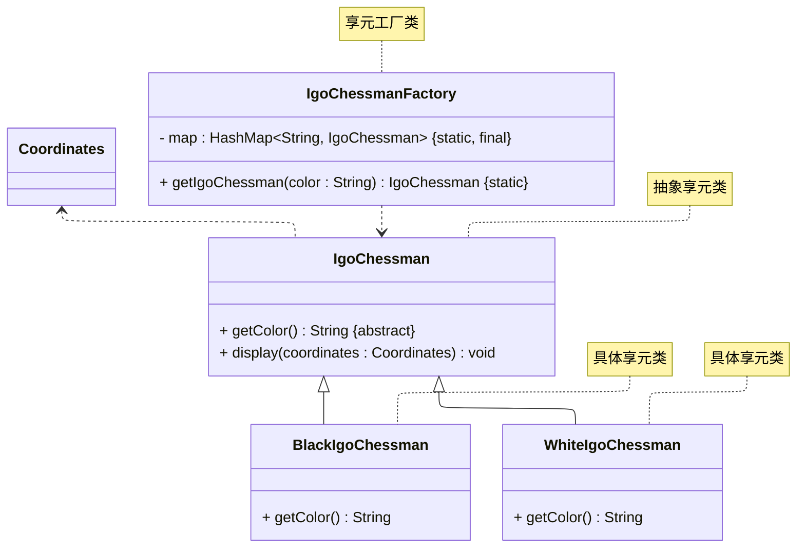

# README
## 享元模式的实现
详细请参考源代码：[src/org/example/Main.java](./src/org/example/Main.java)
> 案例改编自 《Java 设计模式》 —— 刘伟 著 —— 第 14.3 节

其 UML 类图如下所示：

## 参考资料
学习视频：
1. [设计模式快速入门 —— 图灵星球TuringPlanet —— 享元模式](https://www.bilibili.com/video/BV1km4y1B7xQ)
2. [Java设计模式详解 —— 黑马程序员 —— 享元模式（P87 ~ P90）](https://www.bilibili.com/video/BV1Np4y1z7BU?p=87)
3. [Java设计模式 —— 尚硅谷 —— 享元模式（P86 ~ P90）](https://www.bilibili.com/video/BV1G4411c7N4?p=86)

学习读物：
1. 《设计模式：可复用面向对象软件的基础》—— Erich Gamma 著 —— 李英军 译 —— 第 4.6 节（P146）
2. 《Java 设计模式》 —— 刘伟 著 —— 第 14 章（P188）
3. 《设计模式之美》—— 王争 著 —— 第 7.7 节（P239）
4. 《设计模式之禅》 —— 第 2 版 —— 秦小波 著 —— 第 28 章（P356）
5. 《图解设计模式》—— 结城浩 著 —— 杨文轩 译 —— 第 20 章（P237）

电子文献：
1. [设计模式教程 —— 菜鸟教程 —— 享元模式](https://www.runoob.com/design-pattern/flyweight-pattern.html)
2. [99+ 种软件模式 —— long2ge —— 享元模式](https://learnku.com/docs/99-software-pattern/flyweight-pattern/11967)