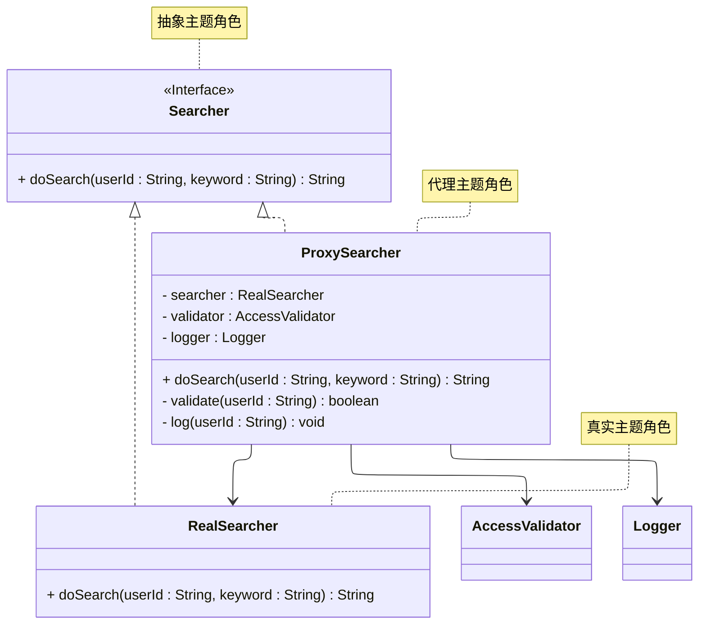

# README
## 静态代理的实现
详细请参考源代码：[src/org/example/Main.java](./src/org/example/Main.java)
> 案例改编自 《Java 设计模式》 —— 刘伟 著 —— 第 15.3 节

其 UML 类图如下所示：

## 参考资料
学习视频：
1. [设计模式快速入门 —— 图灵星球TuringPlanet —— 代理模式](https://www.bilibili.com/video/BV1xg4y1T7vh)
2. [Java设计模式详解 —— 黑马程序员 —— 代理模式（P56 ~ P62）](https://www.bilibili.com/video/BV1Np4y1z7BU?p=56)
3. [Java设计模式 —— 尚硅谷 —— 代理模式（P91 ~ P95）](https://www.bilibili.com/video/BV1G4411c7N4?p=91)

学习读物：
1. 《设计模式：可复用面向对象软件的基础》—— Erich Gamma 著 —— 李英军 译 —— 第 4.7 节（P155）
2. 《Java 设计模式》 —— 刘伟 著 —— 第 15 章（P203）
3. 《设计模式之美》—— 王争 著 —— 第 7.1 节（P209）
4. 《设计模式之禅》 —— 第 2 版 —— 秦小波 著 —— 第 12 章（P113）
5. 《图解设计模式》—— 结城浩 著 —— 杨文轩 译 —— 第 21 章（P249）

电子文献：
1. [设计模式教程 —— 菜鸟教程 —— 代理模式](https://www.runoob.com/design-pattern/proxy-pattern.html)
2. [99+ 种软件模式 —— long2ge —— 代理模式](https://learnku.com/docs/99-software-pattern/proxy-pattern/11963)