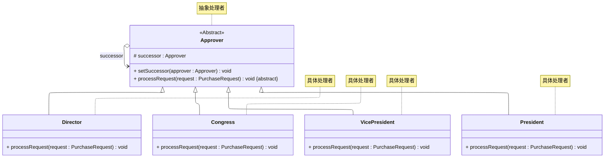

# README
## 职责链模式的实现
演示纯的职责链模式的实习，详细请参考源代码：[src/org/example/Main.java](./src/org/example/Main.java)
> 案例改编自 《Java 设计模式》 —— 刘伟 著 —— 第 16.4 节

其 UML 类图如下：

## 参考资料
学习视频：
1. [设计模式快速入门 —— 图灵星球TuringPlanet —— 职责链模式](https://www.bilibili.com/video/BV14m4y1y7Rj)
2. [Java设计模式详解 —— 黑马程序员 —— 职责链模式（P105 ~ P109）](https://www.bilibili.com/video/BV1Np4y1z7BU?p=105)
3. [Java设计模式 —— 尚硅谷 —— 职责链模式（P145 ~ P149）](https://www.bilibili.com/video/BV1G4411c7N4?p=145)

学习读物：
1. 《设计模式：可复用面向对象软件的基础》—— Erich Gamma 著 —— 李英军 译 —— 第 5.1 节（P167）
2. 《Java 设计模式》 —— 刘伟 著 —— 第 16 章（P221）
3. 《设计模式之美》—— 王争 著 —— 第 8.5 节（P282）
4. 《设计模式之禅》 —— 第 2 版 —— 秦小波 著 —— 第 16 章（P178）
5. 《图解设计模式》—— 结城浩 著 —— 杨文轩 译 —— 第 14 章（P161）

电子文献：
1. [设计模式教程 —— 菜鸟教程 —— 职责链模式](https://www.runoob.com/design-pattern/chain-of-responsibility-pattern.html)
2. [99+ 种软件模式 —— long2ge —— 职责链模式](https://learnku.com/docs/99-software-pattern/chain-of-responsibility-pattern/11990)