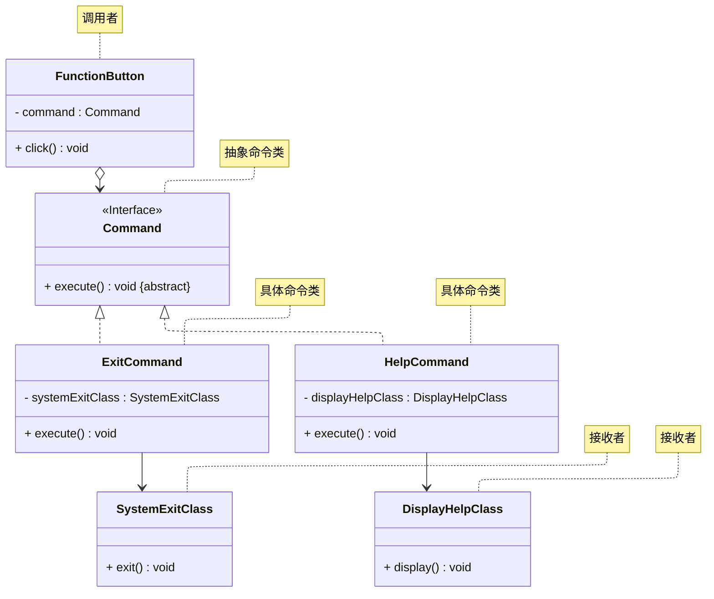
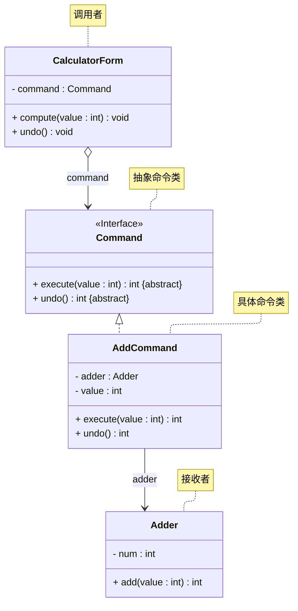

# README
## 案例一
演示命令模式的实现（不含 undo、redo 操作），详细请参考源代码：[src/org/example/case02/Main.java](./src/org/example/case02/Main.java)
> 案例改编自 《Java 设计模式》 —— 刘伟 著 —— 第 17.3 节

其 UML 类图如下所示：

## 案例二
演示命令模式的实现（含 undo 操作），详细请参考源代码：[src/org/example/case02/Main.java](./src/org/example/case02/Main.java)
> 案例改编自 《Java 设计模式》 —— 刘伟 著 —— 第 17.6 节

其 UML 类图为：

## 参考资料
学习视频：
1. [设计模式快速入门 —— 图灵星球TuringPlanet —— 命令模式](https://www.bilibili.com/video/BV1zX4y1m7V5)
2. [Java设计模式详解 —— 黑马程序员 —— 命令模式（P100 ~ P104）](https://www.bilibili.com/video/BV1Np4y1z7BU?p=100)
3. [Java设计模式 —— 尚硅谷 —— 命令模式（P101 ~ P105）](https://www.bilibili.com/video/BV1G4411c7N4?p=101)

学习读物：
1. 《设计模式：可复用面向对象软件的基础》—— Erich Gamma 著 —— 李英军 译 —— 第 5.2 节（P175）
2. 《Java 设计模式》 —— 刘伟 著 —— 第 17 章（P236）
3. 《设计模式之美》—— 王争 著 —— 第 8.11 节（P334）
4. 《设计模式之禅》 —— 第 2 版 —— 秦小波 著 —— 第 15 章（P162）
5. 《图解设计模式》—— 结城浩 著 —— 杨文轩 译 —— 第 22 章（P259）

电子文献：
1. [设计模式教程 —— 菜鸟教程 —— 命令模式](https://www.runoob.com/design-pattern/command-pattern.html)
2. [99+ 种软件模式 —— long2ge —— 命令模式](https://learnku.com/docs/99-software-pattern/command-pattern/11988)