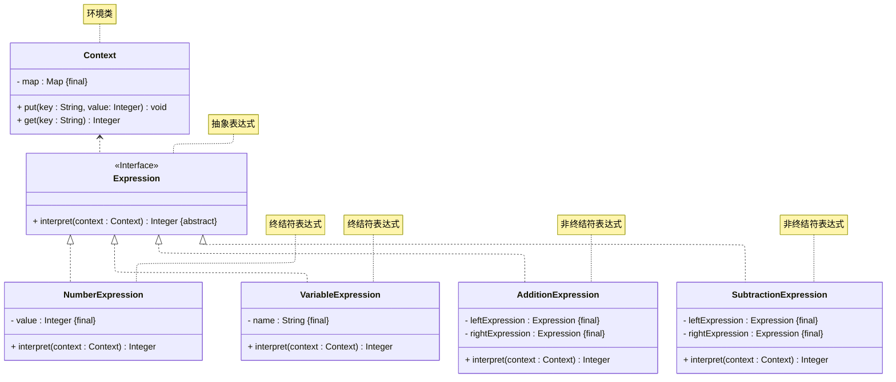

# README
## 解释器模式的实现
案例介绍：使用解释器模式实现一个简易的计算器（包含变量，加法、减法等）。
详细请参考源代码：[src/org/example/Main.java](./src/org/example/Main.java)

其 UML 类图如下所示：

## 参考资料
学习视频：
1. [设计模式快速入门 —— 图灵星球TuringPlanet —— 解释器模式](https://www.bilibili.com/video/BV1CP41117A2)
2. [Java设计模式详解 —— 黑马程序员 —— 解释器模式（P133 ~ P136）](https://www.bilibili.com/video/BV1Np4y1z7BU?p=133)
3. [Java设计模式 —— 尚硅谷 —— 解释器模式（P131 ~ P135）](https://www.bilibili.com/video/BV1G4411c7N4?p=131)

学习读物：
1. 《设计模式：可复用面向对象软件的基础》—— Erich Gamma 著 —— 李英军 译 —— 第 5.3 节（P183）
2. 《Java 设计模式》 —— 刘伟 著 —— 第 18 章（P252）
3. 《设计模式之美》—— 王争 著 —— 第 8.12 节（P337）
4. 《设计模式之禅》 —— 第 2 版 —— 秦小波 著 —— 第 27 章（P346）
5. 《图解设计模式》—— 结城浩 著 —— 杨文轩 译 —— 第 23 章（P273）

电子文献：
1. [设计模式教程 —— 菜鸟教程 —— 解释器模式](https://www.runoob.com/design-pattern/interpreter-pattern.html)
2. [99+ 种软件模式 —— long2ge —— 解释器模式](https://learnku.com/docs/99-software-pattern/interpreter-pattern/11987)